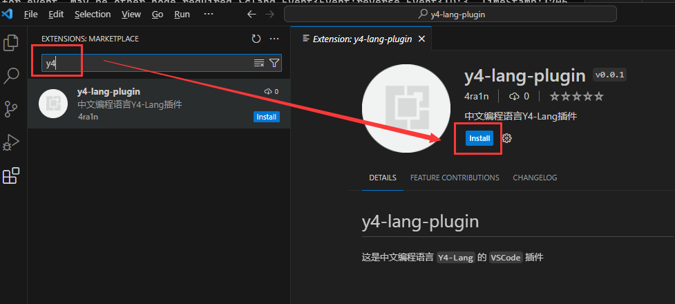
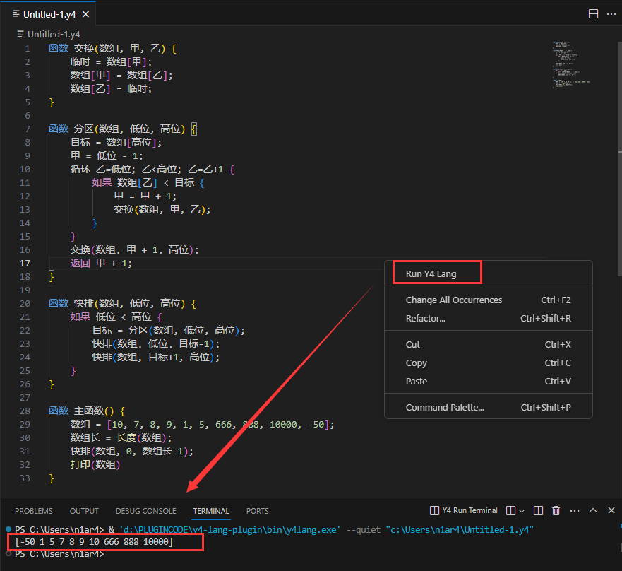

# Y4-Lang


[更新日志 - Change Log](CHANGELOG.md)

`Y4-Lang` 是一个基于 `Golang` 的中文编程语言（解释型脚本语言）

不使用任何第三方库，仅依赖 `Golang` 标准库实现，轻量简单

主要特性：
- 不使用任何库从零实现词法分析，语法分析，解释执行
- 类型包含 `int/float/bool/string` 和 `object`
- 支持 `if/else/while/continue/break` 等基本语法
- 支持数组类型以及 `list` 和 `map` 等高级结构
- 支持通过 `#include` 语法导入多个脚本文件执行
- 支持通过 `def` 语法定义函数和执行
- 支持 `http` 和 `base64` 等常见的库（可扩展）

使用 `Y4-Lang` 实现快排

```text
函数 交换(数组, 甲, 乙) {
    临时 = 数组[甲];
    数组[甲] = 数组[乙];
    数组[乙] = 临时;
}

函数 分区(数组, 低位, 高位) {
    目标 = 数组[高位];
    甲 = 低位 - 1;
    循环 乙=低位; 乙<高位; 乙=乙+1 {
        如果 数组[乙] < 目标 {
            甲 = 甲 + 1;
            交换(数组, 甲, 乙);
        }
    }
    交换(数组, 甲 + 1, 高位);
    返回 甲 + 1;
}

函数 快排(数组, 低位, 高位) {
    如果 低位 < 高位 {
        目标 = 分区(数组, 低位, 高位);
        快排(数组, 低位, 目标-1);
        快排(数组, 目标+1, 高位);
    }
}

函数 主函数() {
    数组 = [10, 7, 8, 9, 1, 5, 666, 888, 10000, -50];
    数组长 = 长度(数组);
    快排(数组, 0, 数组长-1);
    打印(数组)
}
```

运行命令：

```shell
./y4lang --quiet test.y4
```

输出:

```text
[-50 1 5 7 8 9 10 666 888 10000]
```

VSCode插件：y4-lang-plugin



示例



## 示例

- [冒泡排序 (Bubble Sort) 实现](examples/001.y4)
- [快速排序 (Quick Sort) 实现](examples/002.y4)
- [递归实现的二分查找](examples/003.y4)
- [非递归实现的二分查找](examples/004.y4)
- [动态规划解决最长公共子序列 (LCS) 问题](examples/005.y4)
- [数组去重问题的实现](examples/006.y4)
- [接雨水问题的实现](examples/007.y4)
- [回溯算法解决八皇后问题](examples/008.y4)

## Docker

提供了 `Dockerfile` 和脚本，可以自行一键编译

```shell
git clone https://github.com/4ra1n/y4-lang
cd y4-lang
chmod u+x docker-build.sh
sudo ./docker-build.sh
```

## 实用Y4脚本

以下实用脚本完全由 `Y4-Lang` 编写

- [多线程进行TCP全连接端口扫描](poc/port-scan.y4)
- [检测远程WEBLOGIC是否开启了T3协议](poc/weblogic-t3.y4)

## TODO

- 修复BUG
- 完善文档
- 更多示例
- VSCode插件
- ...