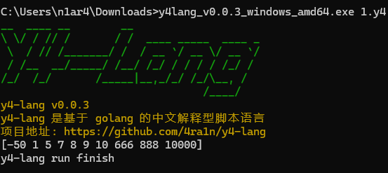

# Y4-Lang


[英文版本 - English Version](README-en.md)

[更新日志 - Change Log](CHANGELOG.md)

`Y4-Lang` 是一个基于 `Golang` 的编程语言（解释型脚本语言）

不使用任何第三方库，仅依赖 `Golang` 标准库实现，语法类似 `Python` 简单易用

```python
def hello(a, b) {
    if a < b {
        print("hello world");
    } else {
        print("error");    
    }
}

array = [1, 2, 3];
b = 2;
hello(array[0], b);
```

主要特性：
- 不使用任何库从零实现词法分析，语法分析，解释执行
- 类型包含 `int/float/bool/string` 和 `object`
- 支持 `if/else/while/continue/break` 等基本语法
- 支持数组类型以及 `list` 和 `map` 等高级结构
- 支持通过 `#include` 语法导入多个脚本文件执行
- 支持通过 `def` 语法定义函数和执行
- 支持 `http` 和 `base64` 等常见的库（可扩展）

使用 `Github Actions` 编译多版本可执行文件：
- windows (arm/arm64/386/amd64)
- darwin (arm64/amd64)
- linux (arm/arm64/386/amd64)

即将支持 `VSCode` 插件一键安装运行

## 快速开始

（1）从 `release` 页面下载你需要的二进制文件

（2）使用 `-f` 参数指定 `y4` 文件（要求后缀必须是`.y4`）

将 `README` 开头部分代码保存到 `test.y4` 并输入

```shell
./y4lang -f test.y4
```

输出



（3）可选参数

- 使用 `--log-level` 指定日志级别（默认 `error` 级别）
- 使用 `--pool-size` 指定协程池大小（不建议改动）
- 使用 `--env-size` 指定默认环境大小（不建议改动）

使用 `--log-level debug` 查看 `AST` 结构，用于反馈 `BUG` 或调试开发

## Docker

提供了 `Dockerfile` 和脚本，可以自行一键编译

```shell
git clone https://github.com/4ra1n/y4-lang
cd y4-lang
chmod u+x docker-build.sh
sudo ./docker-build.sh
```

## VSCode 插件

支持语法高亮，一键启动，正在开发中

## 示例

- [冒泡排序 (Bubble Sort) 实现](examples/001.y4)
- [快速排序 (Quick Sort) 实现](examples/002.y4)
- [递归实现的二分查找](examples/003.y4)
- [非递归实现的二分查找](examples/004.y4)
- [动态规划解决最长公共子序列 (LCS) 问题](examples/005.y4)
- [数组去重问题的实现](examples/006.y4)
- [接雨水问题的实现](examples/007.y4)
- [八皇后问题的实现](examples/008.y4)